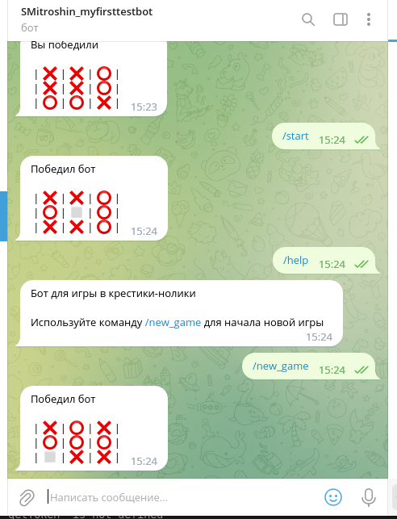
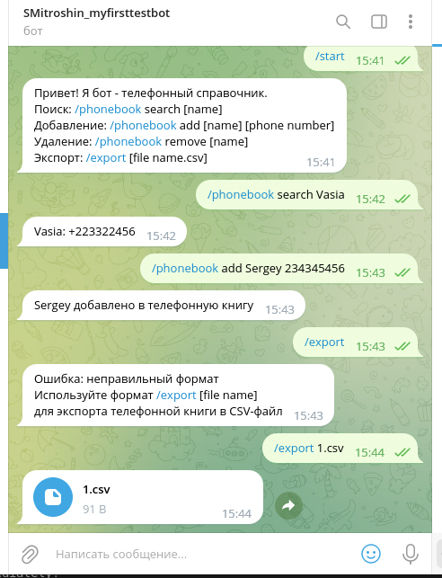

# Телеграм-бот для игры в крестики-нолики

Файл бота - ttt.py
Комманды бота:
* `/help` - показать раздел "Помощь";
* `/start` - аналогичен `/help`, используется для инициализации бота.

# Телеграм-бот Телефонная книга

Файл бота - phonebook,py
Комманды бота:

* `/phonebook search [name]` - Поиск 
* `/phonebook add [name] [phone number]` - Добавление
* `/phonebook remove [name]` -Удаление
* `/export [file name.csv]1` - Экспорт
* `/start` - инициализация бота.

Для работы ботов необходимо иметь установленную библиотеку [python-telegram-bot](https://python-telegram-bot.org/). Для её установки воспользуйтесь командой:
`pip install python-telegram-bot` в виртуальном окружении.